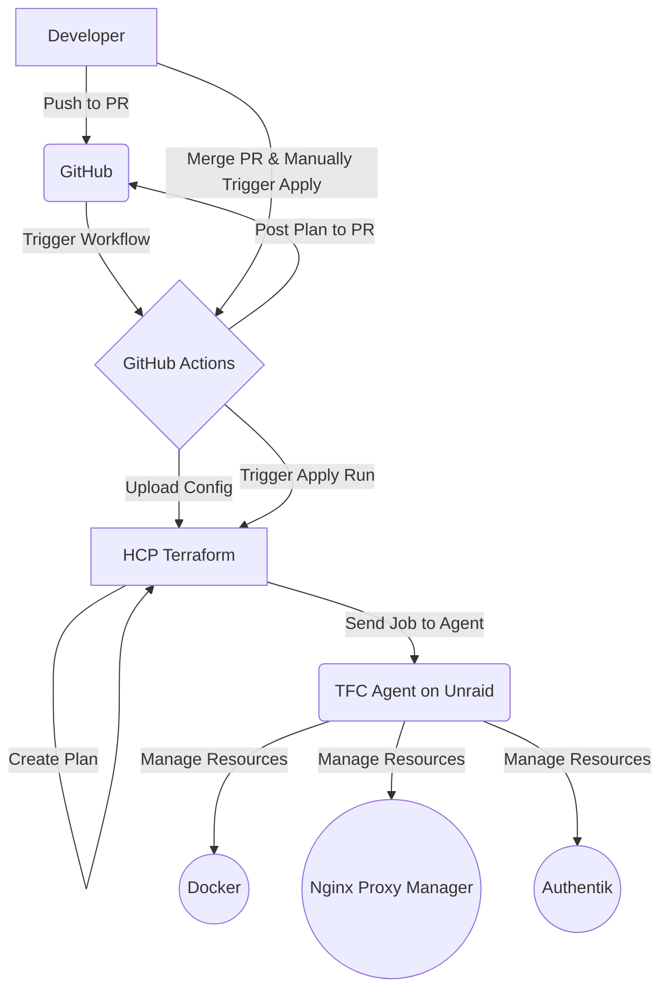

  <h1>Home-Net</h1>
  
<strong>Home Lab IaC</strong>

This repository contains configurations for managing various services and infrastructure components within my home network.

## 🎯 Purpose

This repository automates the deployment and configuration of my home lab. The primary goal is to maintain a completely reproducible environment using IaC. This ensures that the entire lab can be quickly and reliably rebuilt from scratch in the event of a catastrophic failure.

## ✨ Key Features

*   **Infrastructure as Code**: The entire infrastructure is defined using Terraform.
*   **GitOps Workflow**: Changes are managed through Pull Requests, with automated plans generated by GitHub Actions and HCP Terraform.
*   **Automated Deployments**: Services are deployed as Docker containers on an Unraid server via a self-hosted Terraform agent.
*   **Dynamic Configuration**: Service definitions are externalized to YAML files (`stacks.yaml`, `services.yaml`), allowing for easy modification.
*   **Automated Proxy & DNS**: Nginx Proxy Manager is used to automatically create proxy hosts and manage SSL certificates for services.
*   **Centralized Authentication**: Services are integrated with Authentik for single sign-on (SSO) and access control.

## 🏗️ Architecture Overview

The workflow is designed around a GitOps model, where `git` is the single source of truth.

## ✅ Prerequisites
Before running this configuration, the following components must be in place.

### Host Environment
- **Server**: An **Unraid server** is the primary target environment.
- **Docker**: Docker must be installed and running.
- **Network Interfaces**: The Unraid server must have two bridged network interfaces configured:
  - `br0`: For the primary LAN (e.g., `192.168.1.0/24`).
  - `br1`: For the container-specific network (e.g., `192.168.4.0/23`).

### Core Services
- **Terraform Agent**: A HCP Terraform Agent must be running on the Unraid server with access to the Docker socket (`/var/run/docker.sock`).
- **Nginx Proxy Manager**: An instance of Nginx Proxy Manager must be running and accessible to the Terraform agent.
- **Authentik**: An instance of Authentik must be running and configured.

### Cloud & API Access
- **HCP Terraform**: A workspace must be created and configured.
- **Cloudflare**: An API token is required with the following permissions:
  - `Zone:Read`
  - `DNS:Edit`
  - The token must have access to all zones being managed.

## 🚀 Workflow

This repository follows a strict Pull Request-based workflow to ensure changes are reviewed and validated before being applied.

1.  **Make Changes**: Create a new branch and make your desired infrastructure changes.
2.  **Open a Pull Request**: Push your branch to GitHub and open a Pull Request against the `main` branch.
3.  **Automated Plan**: The `run-plan.yml` GitHub Actions workflow automatically triggers. It uploads your configuration to HCP Terraform and runs a `terraform plan`.
4.  **Review Plan**: The output of the plan is posted as a comment on your Pull Request for review. You can also view the full plan in the HCP Terraform UI.
5.  **Merge**: Once the plan is approved, merge the Pull Request into `main`.
6.  **Apply Changes**: The `run-apply.yml` action must be triggered manually from the GitHub Actions UI to apply the changes to production. This is a deliberate safety measure.

## ⚙️ Configuration

This project is configured primarily through YAML files located in the `config/` directory. For detailed instructions on how to structure these files, please refer to the documentation in the `docs/` directory:

*   **Stack Configuration Guide**: [stack-config.md](docs/stack-config.md)
*   **Service Configuration Guide**: [service-config.md)

## 🔐 Secrets Management

Secrets are managed securely without ever being committed to the repository.

### Static Secrets
Static secrets, such as API tokens and passwords, are stored as **sensitive variables** directly in the HCP Terraform workspace. The agent automatically and securely injects these at runtime.

|Variable Name|Type|Sensitive?|
|---|---|---|
|cloudflare_api_token|terraform|Y|
|vpn_user|terraform|Y|
|vpn_pass|terraform|Y|
|network_admin_email|terraform|Y|
|nginx_proxy_address|terraform|N|
|nginx_proxy_pass|terraform|Y|
|nginx_proxy_user|terraform|Y|
|public_facing_ip|terraform|Y|
|technitium_api_token|terraform|Y|
|technitium_host|terraform|N|
|AUTHENTIK_URL|env|N|
|AUTHENTIK_TOKEN|env|Y|
|AUTHENTIK_INSECURE|env|N|
|AUTHENTIK_TOKEN|env|Y|
|AUTHENTIK_URL|env|N|
|vpn_pass|terraform|Y|
|vpn_user|terraform|Y|

> **Note**: Some non-secret values (like `public_facing_ip`) are marked as sensitive to prevent them from being exposed in public logs or plan outputs.

### Dynamic Secrets
For services deployed by the `proxy_service_stack` module, credentials are not stored statically. Instead:
1.  A strong, random password is generated for each service during the `terraform apply` process using the `random` provider.
2.  These generated credentials (`username: admin`, `password: <random>`) are stored as attributes on the service-specific group created within Authentik.

This ensures that each service has a unique, high-entropy password that is managed entirely by Terraform.

## ⚠️ Operational Notes

### Manual Step for Authentik Proxy Providers

Due to an issue with the Authentik Terraform provider (#12), a manual step is required after deploying a new service that uses proxy authentication.

1.  After a successful `terraform apply`, navigate to your Authentik instance.
2.  Go to **Applications** -> **Providers**.
3.  Find the provider for your service (e.g., `prowlarr`).
4.  Edit the provider and assign it to the correct **Proxy Outpost**.

The credentials for the service can be found by navigating to the corresponding group in Authentik (e.g., `tf_prowlarr`) and viewing its attributes.

### Icons

The following are good sources for icons:

- https://dashboardicons.com
- https://iconduck.com