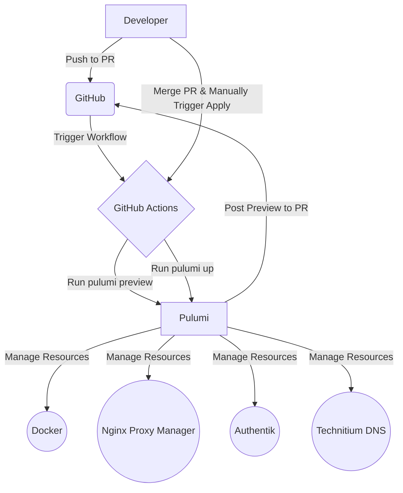

<div align="center">
  <h1>Home-Net</h1>
  <p><strong>Home Lab IaC</strong></p>
</div>

This repository contains configurations for managing various services and infrastructure components within my home network.

## 🎯 Purpose

This repository automates the deployment and configuration of my home lab. The primary goal is to maintain a completely reproducible environment using IaC. This ensures that the entire lab can be quickly and reliably rebuilt from scratch in the event of a catastrophic failure.

Comprehensive documentation can be found in [docs/infra](docs/infra/Home.md)
## ✨ Key Features

*   **Infrastructure as Code**: The entire infrastructure is defined using Pulumi (Go).
*   **GitOps Workflow**: Changes are managed through Pull Requests, with automated previews generated by GitHub Actions.
*   **Automated Deployments**: Services are deployed as Docker containers on an Unraid server via Pulumi running in GitHub Actions.
*   **Dynamic Configuration**: Service definitions are externalized to YAML files in the `config/stacks/` and `config/services/` directories, allowing for easy modification.
*   **Automated Proxy & DNS**: Nginx Proxy Manager is used to automatically create proxy hosts and manage SSL certificates for services.
*   **Centralized Authentication**: Services are integrated with Authentik for single sign-on (SSO) and access control.


## 🏗️ Architecture Overview

The workflow is designed around a GitOps model, where `git` is the single source of truth.


```mermaid
graph TD
    A[Developer] -- Push to PR --> B(GitHub);
    B -- Trigger Workflow --> C{GitHub Actions};
    C -- Run pulumi preview --> D[Pulumi];
    D -- Post Preview to PR --> B;
    A -- Merge PR & Manually Trigger Apply --> C;
    C -- Run pulumi up --> D;
    D -- Manage Resources --> F((Docker));
    D -- Manage Resources --> G((Nginx Proxy Manager));
    D -- Manage Resources --> H((Authentik));
    D -- Manage Resources --> I((Technitium DNS));
```

## ✅ Prerequisites
Before running this configuration, the following components must be in place.

### Host Environment
- **Server**: An **Unraid server** is the primary target environment.
- **Docker**: Docker must be installed and running.
- **Network Interfaces**: The Unraid server must have two bridged network interfaces configured:
  - `br0`: For the primary LAN (e.g., `192.168.1.0/24`).
  - `br1`: For the container-specific network (e.g., `192.168.4.0/23`).

### Core Services
- **Nginx Proxy Manager**: Must be running and accessible before applying the `apps` stack. Managed separately via the `core` Pulumi stack.
- **Technitium DNS**: Must be running and accessible before applying the `apps` stack. Managed separately via the `core` Pulumi stack.
- **Authentik**: An instance of Authentik must be running and configured.

### Pulumi Setup
- **Pulumi CLI**: Install from https://www.pulumi.com/docs/install/
- **Pulumi Login**: Run `pulumi login` to authenticate with Pulumi Cloud (or `pulumi login --local` for local state).
- **Custom Provider Binaries**: Build and install the three custom providers by running `./scripts/build-providers.sh` from the `pulumi/` directory.

### Cloud & API Access
- **Cloudflare**: An API token is required with the following permissions:
  - `Zone:Read`
  - `DNS:Edit`
  - The token must have access to all zones being managed.

## 🚀 Workflow


This repository follows a strict Pull Request-based workflow to ensure changes are reviewed and validated before being applied.

1.  **Make Changes**: Create a new branch and make your desired infrastructure changes.
2.  **Open a Pull Request**: Push your branch to GitHub and open a Pull Request against the `main` branch.
3.  **Automated Preview**: The `run-plan.yml` GitHub Actions workflow automatically triggers and runs `pulumi preview`.
4.  **Review Preview**: The output of the preview is posted as a comment on your Pull Request for review.
5.  **Merge**: Once the preview is approved, merge the Pull Request into `main`.
6.  **Apply Changes**: Merging to `main` automatically triggers the `run-apply.yml` workflow, which applies changes sequentially—first to the `core` stack, then to `apps`. The workflow can also be triggered manually via `workflow_dispatch`.

## ⚙️ Configuration

This project is configured primarily through YAML files located in the `config/` directory. For detailed instructions on how to structure these files, please refer to the documentation in the `docs/` directory:

*   **Stack Configuration Guide**: [stack-config.md](docs/config/stack-config.md)
*   **Service Configuration Guide**: [service-config.md](docs/config/service-config.md)


## 🔐 Secrets Management

Secrets are managed securely without ever being committed to the repository.

### Static Secrets

Static secrets, such as API tokens and passwords, are stored as **Pulumi config secrets** using `pulumi config set --secret`. The values are encrypted in the Pulumi stack state and injected at runtime.

Run these commands from the `pulumi/` directory to configure secrets:

```bash
pulumi config set --secret cloudflareApiToken <value>
pulumi config set --secret dnsAdminPassword <value>
pulumi config set --secret infisicalClientId <value>
pulumi config set --secret infisicalClientSecret <value>
pulumi config set --secret adminEmail <value>
pulumi config set adminUsername <value>
pulumi config set proxyAddress <value>
pulumi config set --secret proxyPass <value>
pulumi config set proxyUser <value>
pulumi config set --secret publicFacingIp <value>
pulumi config set --secret technitiumApiToken <value>
pulumi config set technitiumHost <value>
pulumi config set --secret technitiumPassword <value>
pulumi config set --secret authentikUrl <value>
pulumi config set --secret authentikToken <value>
pulumi config set --secret ghcrUsername <value>
pulumi config set --secret ghcrToken <value>
```

> **Note**: Some non-secret values (like `publicFacingIp`) can be marked as secret to prevent them from appearing in public logs or preview outputs.

### Dynamic Secrets
For services deployed by the stack module, credentials are not stored statically. Instead:
1.  **Infisical Integration**: For services requiring arbitrary secrets (like API keys or JWT signing keys), define per-service secrets in the `secrets:` map. Pulumi fetches these from Infisical Cloud and injects them as environment variables.
2.  **Generated Secrets**: For secrets that need a stable random value (like database passwords), list them under `generated_secrets` in a stack YAML file. Pulumi generates a random 32-character password and stores it in Pulumi state, substituting `${KEY}` placeholders in env vars.
3.  **OAuth Credentials**: For services using OAuth, the stack automatically creates an OAuth2 provider in Authentik. The resulting `client_id` and `client_secret` are injected as environment variables into the container.

This ensures that secrets are managed dynamically and securely, with minimal manual intervention.

## ⚠️ Operational Notes

### Manual Step for Authentik Proxy Providers

Due to a limitation with the Authentik custom provider, a manual step is required after deploying a new service that uses proxy authentication.

1.  After a successful `pulumi up`, navigate to your Authentik instance.
2.  Go to **Applications** -> **Providers**.
3.  Find the provider for your service (e.g., `prowlarr`).
4.  Edit the provider and assign it to the correct **Proxy Outpost**.

The credentials for the service can be found by navigating to the corresponding group in Authentik (e.g., `tf_prowlarr`) and viewing its attributes.

### Icons

The following are good sources for icons:

- https://dashboardicons.com
- https://iconduck.com
