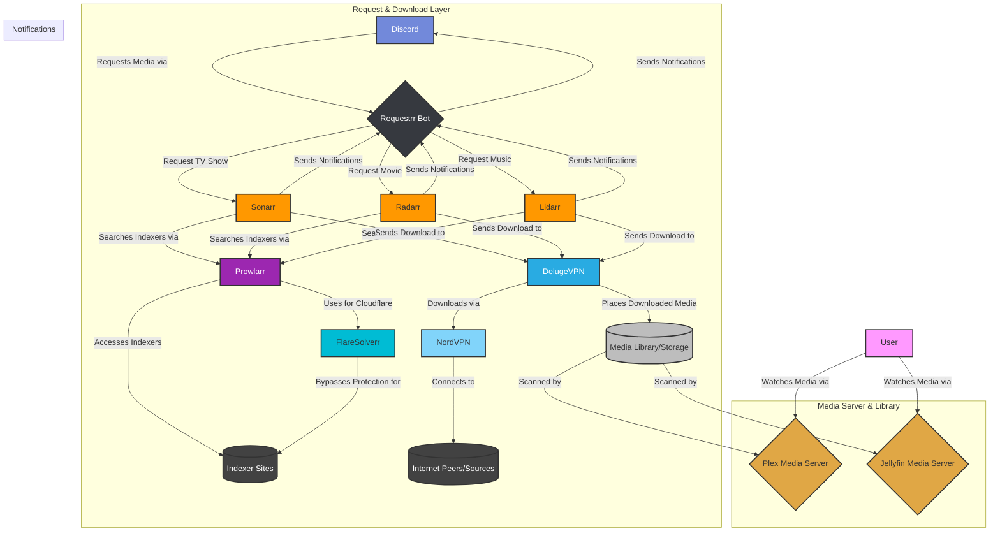

# Media

```mermaid
graph TD
    A_User[User] -- "Watches Media via" --> B_PlexServer{"Plex Media Server"}
    A_User -- "Watches Media via" --> C_JellyfinServer{"Jellyfin Media Server"}

    subgraph "Request & Download Layer"
        D_Discord[Discord] -- "Requests Media via" --> E_Requestrr{"Requestrr Bot"}
        E_Requestrr -- "Request TV Show" --> F_Sonarr[Sonarr]
        E_Requestrr -- "Request Movie" --> G_Radarr[Radarr]
        E_Requestrr -- "Request Music" --> H_Lidarr[Lidarr]

        F_Sonarr -- "Searches Indexers via" --> I_Prowlarr[Prowlarr]
        G_Radarr -- "Searches Indexers via" --> I_Prowlarr
        H_Lidarr -- "Searches Indexers via" --> I_Prowlarr

        I_Prowlarr -- "Accesses Indexers" --> J_Indexers[(Indexer Sites)]
        I_Prowlarr -- "Uses for Cloudflare" --> K_FlareSolverr[FlareSolverr]
        K_FlareSolverr -- "Bypasses Protection for" --> J_Indexers

        F_Sonarr -- "Sends Download to" --> L_DelugeVPN[DelugeVPN]
        G_Radarr -- "Sends Download to" --> L_DelugeVPN
        H_Lidarr -- "Sends Download to" --> L_DelugeVPN

        L_DelugeVPN -- "Downloads via" --> M_NordVPN[NordVPN]
        M_NordVPN -- "Connects to" --> N_Internet[(Internet Peers/Sources)]
        L_DelugeVPN -- "Places Downloaded Media" --> O_MediaLibrary[(Media Library/Storage)]
    end

    subgraph "Media Server & Library"
        O_MediaLibrary -- "Scanned by" --> B_PlexServer
        O_MediaLibrary -- "Scanned by" --> C_JellyfinServer
    end

    subgraph "Notifications"
        E_Requestrr -- "Sends Notifications" --> D_Discord
        F_Sonarr -- "Sends Notifications" --> E_Requestrr
        G_Radarr -- "Sends Notifications" --> E_Requestrr
        H_Lidarr -- "Sends Notifications" --> E_Requestrr
    end

    classDef user fill:#f9f,stroke:#333,stroke-width:2px;
    classDef comms fill:#7289da,stroke:#333,stroke-width:2px,color:#fff;
    classDef request fill:#36393f,stroke:#333,stroke-width:2px,color:#fff;
    classDef arr fill:#ff9800,stroke:#333,stroke-width:2px;
    classDef indexer fill:#9c27b0,stroke:#333,stroke-width:2px,color:#fff;
    classDef utility fill:#00bcd4,stroke:#333,stroke-width:2px;
    classDef download fill:#29abe2,stroke:#333,stroke-width:2px,color:#fff;
    classDef vpn fill:#81d4fa,stroke:#333,stroke-width:2px;
    classDef mediaserver fill:#e0a745,stroke:#333,stroke-width:2px;
    classDef storage fill:#bdbdbd,stroke:#333,stroke-width:2px;
    classDef internet fill:#424242,stroke:#333,stroke-width:2px,color:#fff;

    class A_User user;
    class D_Discord comms;
    class E_Requestrr request;
    class F_Sonarr,G_Radarr,H_Lidarr arr;
    class I_Prowlarr indexer;
    class K_FlareSolverr utility;
    class L_DelugeVPN download;
    class M_NordVPN vpn;
    class B_PlexServer,C_JellyfinServer mediaserver;
    class O_MediaLibrary storage;
    class J_Indexers,N_Internet internet;
```